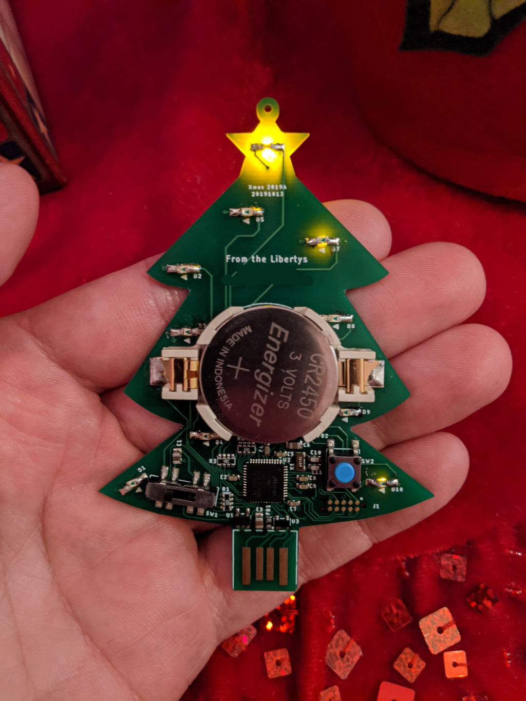

# Introduction

This repository contains the hardware and software for the ornament designed
for Christmas 2019.  The ornament contains LEDs that illuminate through the
circuit board.  The LEDs are controlled by a SAMD21 processor running Arduino
code.  The ornament looks like this:

# Configuration

This project is based upon the Arduino Zero, specifically the [Adafruit
Feather M0 Basic](https://learn.adafruit.com/adafruit-feather-m0-basic-proto/using-with-arduino-ide)
with the Adafruit bootloader.

https://adafruit.github.io/arduino-board-index/package_adafruit_index.json

Add Arduino SAMD21 boards.

Unfortunately, I used pins that did not normally have PWM (analogWrite) 
support.  So, I hacked the board variant definition so that it does.  For now,
you can replace the Feather M0 Express definition:

    cp arduino\variant.cpp "%LOCALAPPDATA%\Arduino15\packages\adafruit\hardware\samd\1.5.7\variants\feather_m0_express\variant.cpp"

## Manufacturing

* Surface mount all parts except LEDs and battery holder.
* Manually solder LEDs facing "wrong way".
* Manually solder battery holder.
* Program the [bootloader](https://learn.adafruit.com/how-to-program-samd-bootloaders).
* Program the Arduino program.

